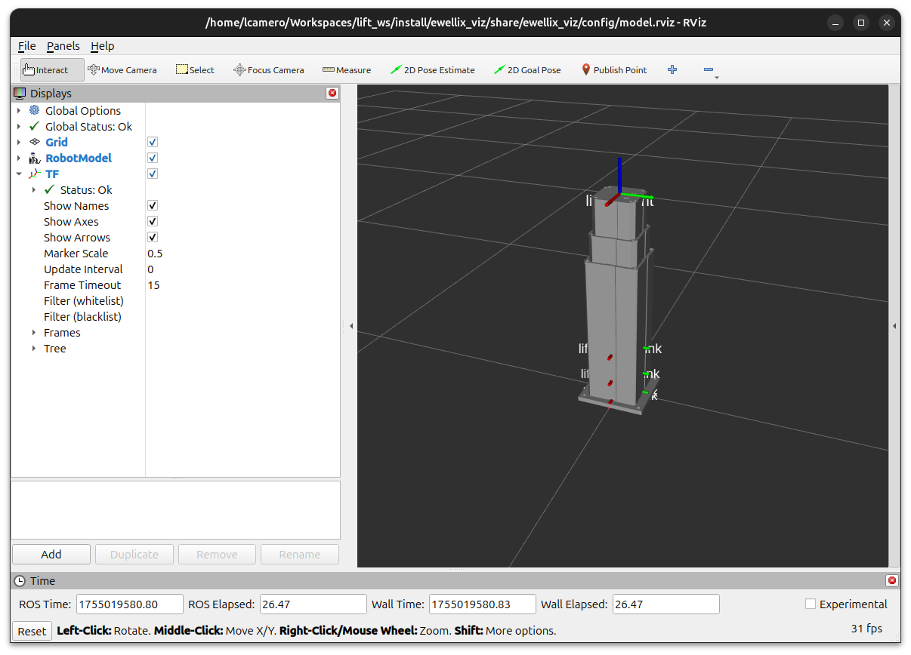
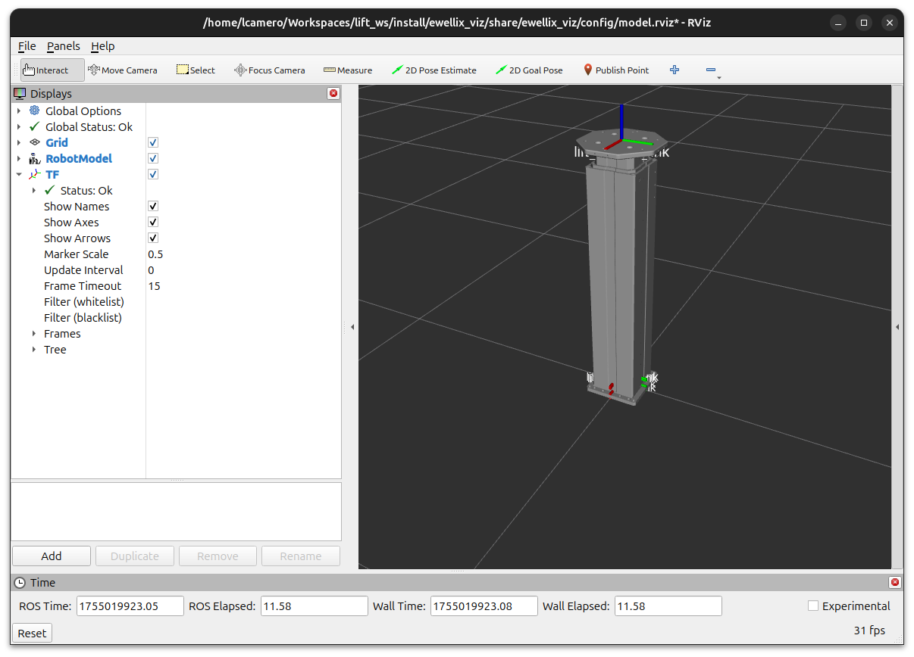

# Ewellix Common Packages

ROS2 description, MoveIt configuration, and interface packages for the Ewellix TLT lifts.


## Ewellix Driver Package
See the [Ewellix driver repository](https://github.com/clearpathrobotics/ewellix_lift) for more information on commanded a real lift through ROS.

## Ewellix Visualization
The `ewellix_viz` package provides a launch file to load the URDF using specific lift parameters and display it in RViz.

By default, the `tlt_x25` lift is used. This lift has a 500 mm stroke, but has a taller base than the `tlt_x15` that provides less torque.



```bash
ros2 launch ewellix_viz rviz_model.launch.py
```

To switch to a different lift type, pass in a different configuration file using the `lift_parameters` launch parameter. For example, the Ewellix UR 620 designed to mount UR manipulators can be selected as follows:



```bash
ros2 launch ewellix_viz rviz_model.launch.py lift_parameters:=/path/to/ewellix_description/config/ur_620.yaml
```
> Change the `/path/to/` path prefix with the path to the `ur_620.yaml` in the `ewellix_description` package


It is also possible to the move the base plate and mounting plate from the model.

To remove the base plate, use the `add_plate` launch argument:

<table>
<tr>
<td>
<center>
<figure>
    
</figure>
</center>
</td>
<td>
<center>
<figure>
    
</figure>
</center>
</td>
</tr>
</table>
