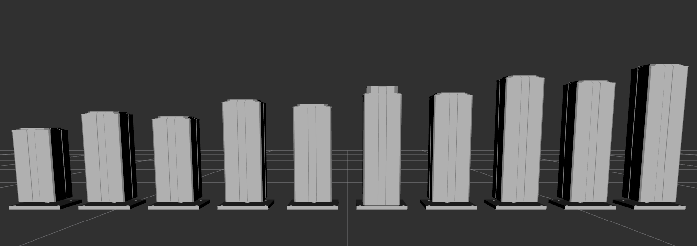
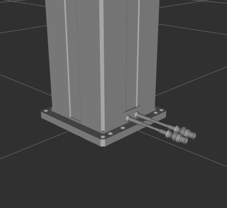
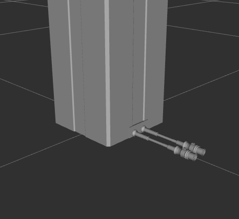
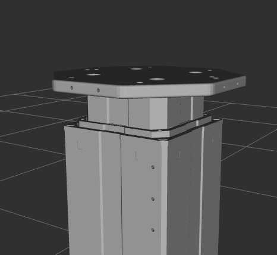
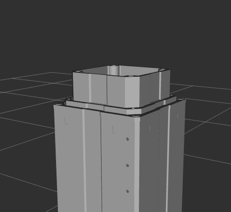
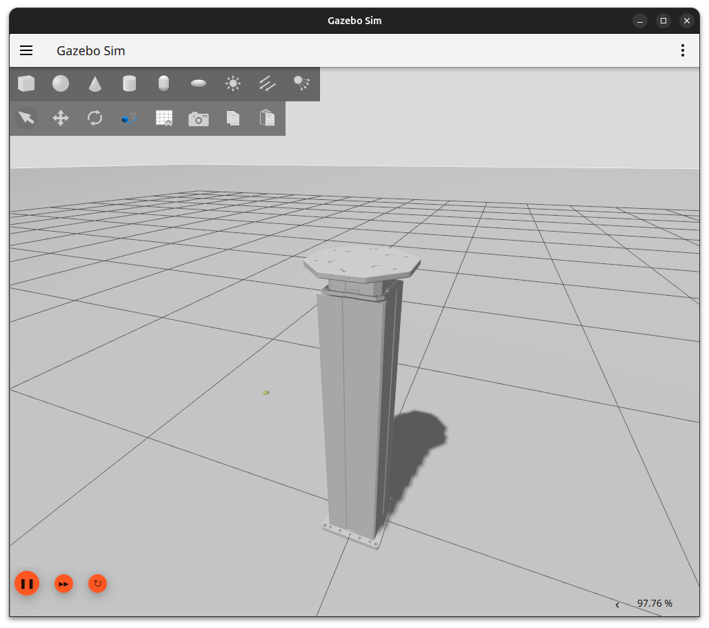
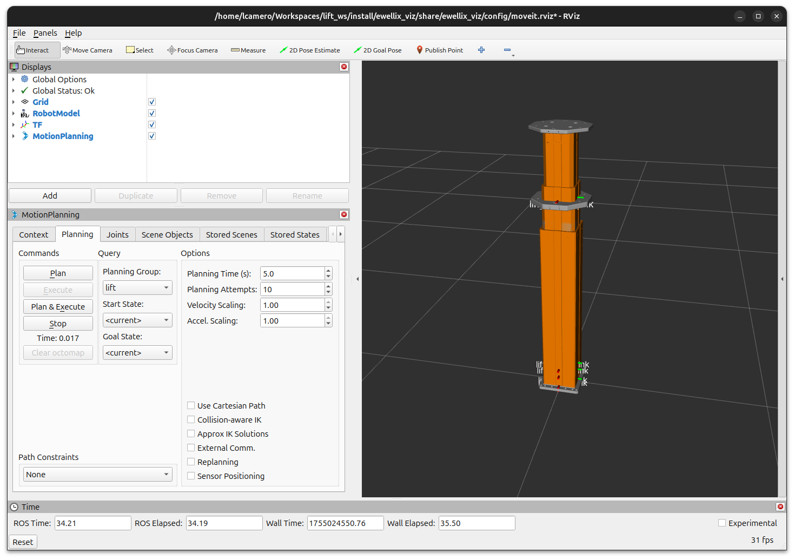

# Ewellix Common Packages

ROS2 description, MoveIt configuration, and interface packages for the Ewellix TLT lifts.



## Ewellix Driver Package
See the [Ewellix driver repository](https://github.com/clearpathrobotics/ewellix_lift) for more information on commanding a real lift through ROS.

## Ewellix Visualization
The `ewellix_viz` package provides a launch file to load the URDF using specific lift parameters and display it in RViz.

By default, the `tlt_x25` lift is used. This lift has a 500 mm stroke, but has a taller base than the `tlt_x15` that provides less torque.


```bash
ros2 launch ewellix_viz rviz_model.launch.py
```

### Lift Parameters
To switch to a different lift type, pass in a different configuration file using the `lift_parameters` launch parameter. For example, the Ewellix UR 620 designed to mount UR manipulators can be selected as follows:


```bash
ros2 launch ewellix_viz rviz_model.launch.py lift_parameters:=/path/to/ewellix_description/config/ur_620.yaml
```
> Change the `/path/to/` path prefix with the path to the `ur_620.yaml` in the `ewellix_description` package


### Base Plate
It is also possible to the move the base plate and mounting plate from the model.

To remove the base plate, use the `add_plate` launch argument:

<table>
<tr>
<td>
<center>
<figure>
    
</figure>
</center>
</td>
<td>
<center>
<figure>
    
</figure>
</center>
</td>
</tr>
</table>

```bash
ros2 launch ewellix_viz rviz_model.launch.py lift_parameters:=/path/to/ewellix_description/config/ur_620.yaml add_plate:=false
```

### Mounting Plate
To remove the mounting plate, use the `add_mount` launch argument:

<table>
<tr>
<td>
<center>
<figure>
    
</figure>
</center>
</td>
<td>
<center>
<figure>
    
</figure>
</center>
</td>
</tr>
</table>

```bash
ros2 launch ewellix_viz rviz_model.launch.py lift_parameters:=/path/to/ewellix_description/config/ur_620.yaml add_mount:=false
```

## Ewellix Simulation
The simulation requires Gazebo installed from the ROS vendor packages. Use `rosdep` to install the dependencies on the `ewellix_sim` package.

Use the same parameters from the `Ewellix Visualization` section to select a lift type, then launch the simulation from the `ewellix_sim` package launch file.



```bash
ros2 launch ewellix_sim simulation.launch.py lift_parameters:=/path/to/ewellix_description/config/ur_620.yaml add_mount:=true add_plate:=true
```

### Simulation without MoveIt!
By default, the controller loaded to the simulated ROS 2 control plugin is the `JointGroupPositionController` using the [`jpc.yaml`](./ewellix_description/config/control/jpc.yaml). This controller allows the desired position of the lift to be set directly by the user through the `/lift_position_controller/commands` topic.

After starting the simulation, use the following command to set the height of the lift:

```
ros2 topic pub /lift_position_controller/commands std_msgs/msg/Float64MultiArray 'layout:
  dim: []
  data_offset: 0
data: [0.2]
'
```

> The command above directs the lift to move its joints to position `0.2`. Since the two joints are mirrored, the total vertical offset from the zero-th position is `0.4`.

### Simulation with MoveIt!
To simulate the lift with the `JointTrajectoryController` compatible with MoveIt!, set the `controller_file` to `jtc.yaml` and enable `moveit`. Then, use the `MotionPlanning` RViz plugin to set the target joint position and then `Plan & Execute` to move the lift in Gazebo.



```
ros2 launch ewellix_examples simulation.launch.py lift_parameters:=/path/to/ewellix_description/config/ur_620.yaml add_mount:=true add_plate:=true controller_file:=jtc.yaml moveit:=true rviz:=true
```
